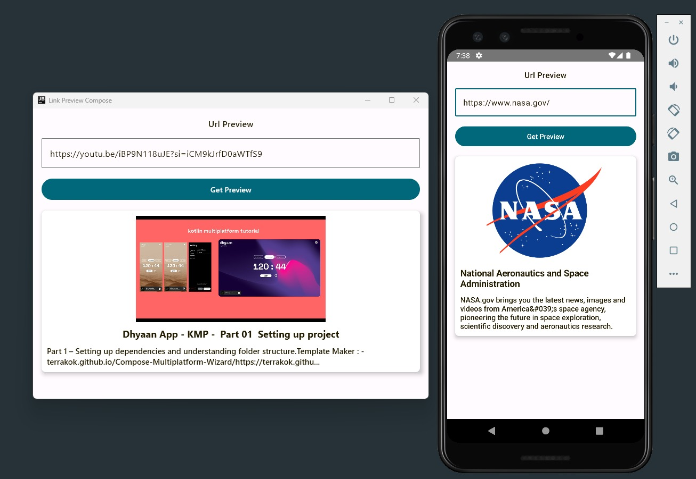
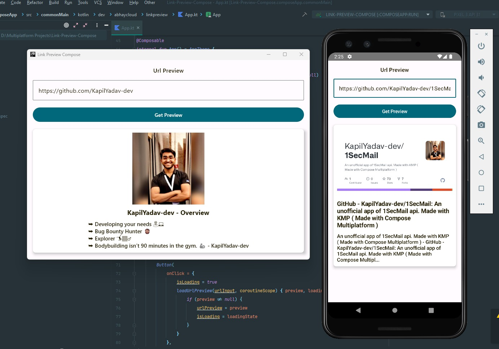

# URLPreviewer-Multiplatform 🚀

URLPreviewer-Multiplatform is a lightweight Compose-based single-page application for fetching and displaying Open Graph (OG) title, description, and images from URLs. It's a fun weekend project exploring multiplatform development.



Feel free to explore, modify, or use this project as a starting point for your own experiments and learning.

## Before running!
 - check your system with [KDoctor](https://github.com/Kotlin/kdoctor)
 - install JDK 8 on your machine
 - add `local.properties` file to the project root and set a path to Android SDK there
 - run `./gradlew podInstall` in the project root

### Android
To run the application on android device/emulator:  
 - open project in Android Studio and run imported android run configuration

To build the application bundle:
 - run `./gradlew :composeApp:assembleDebug`
 - find `.apk` file in `composeApp/build/outputs/apk/debug/composeApp-debug.apk`

### Desktop
Run the desktop application: `./gradlew :composeApp:run`

### iOS
To run the application on iPhone device/simulator:
 - Open `iosApp/iosApp.xcworkspace` in Xcode and run standard configuration
 - Or use [Kotlin Multiplatform Mobile plugin](https://plugins.jetbrains.com/plugin/14936-kotlin-multiplatform-mobile) for Android Studio

### Browser
Run the browser application: `./gradlew :composeApp:jsBrowserDevelopmentRun`

**Clone this repository:**

```shell
git clone https://github.com/Abhay-cloud/URLPreviewer-Multiplatform.git
```

## License

This project is open-source and available under the MIT License. See the [LICENSE](LICENSE) file for details.

## Screenshot


## Contact

If you have any questions or suggestions, please feel free to reach out to me via [GitHub Issues](https://github.com/Abhay-cloud/URLPreviewer-Multiplatform/issues)
